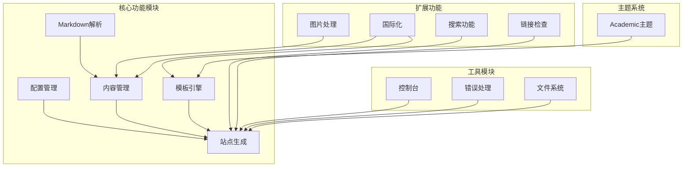

# 🎓 Academic-Zola

## 📚 项目介绍

Academic-Zola 是一个基于 [Zola](https://www.getzola.org/) 静态网站生成器的学术个人网站主题。它专为教授、研究人员和学生设计，帮助您快速创建一个专业的学术主页。

### ✨ 特色功能

- 🌓 **暗黑/明亮模式切换** - 提供自动和手动主题切换功能
- 🌐 **多语言支持** - 内置英文和中文支持，易于扩展其他语言
- 📱 **响应式设计** - 在所有设备上都能获得最佳浏览体验
- 🔍 **全站搜索** - 快速查找内容
- 📊 **学术成果展示** - 论文、项目、教学经历的专业展示
- 📰 **博客功能** - 分享您的研究见解和学术动态

## 🛠️ 技术架构

Academic-Zola 项目由以下主要功能模块组成：



### 📋 模块说明

- **核心功能模块**
  - **配置管理(Config)**: 处理站点配置信息，读取 `config.toml`
  - **内容管理(Content)**: 处理 Markdown 文档和其他资源文件
  - **模板引擎(Templates)**: 渲染页面模板，支持主题定制
  - **Markdown解析**: 将 Markdown 转换为 HTML
  - **站点生成(Site)**: 整合所有模块，生成最终静态网站

- **扩展功能**
  - **搜索功能(Search)**: 提供站内全文搜索能力
  - **图片处理(ImageProc)**: 优化图片资源
  - **链接检查(LinkChecker)**: 验证站点内外链接有效性
  - **国际化(I18n)**: 支持多语言内容和界面切换

- **主题系统**
  - **Academic主题**: 为学术网站定制的美观主题

- **工具模块**
  - **控制台(Console)**: 命令行界面
  - **错误处理(Errors)**: 统一错误处理机制
  - **文件系统(FileSystem)**: 文件操作处理

## 🚀 开发计划表

| 阶段 | 任务 | 状态 | 计划完成时间 |
|------|------|------|------------|
| **1️⃣ 基础架构** | 项目初始化 | ✅ 完成 | - |
|  | 基础主题结构搭建 | ✅ 完成 | - |
|  | 响应式布局实现 | ✅ 完成 | - |
| **2️⃣ 核心功能** | 多语言支持 | ✅ 完成 | - |
|  | 暗黑模式切换 | ✅ 完成 | - |
|  | 学术信息展示模板 | ✅ 完成 | - |
|  | 全站搜索功能 | ✅ 完成 | - |
| **3️⃣ 扩展功能** | 论文展示页面 | ⏳ 进行中 | 2024-05-15 |
|  | 教学经历展示 | ⏳ 进行中 | 2024-05-30 |
|  | 研究项目展示 | 📅 计划中 | 2024-06-15 |
|  | 博客功能 | 📅 计划中 | 2024-06-30 |
| **4️⃣ 优化阶段** | SEO优化 | 📅 计划中 | 2024-07-15 |
|  | 性能优化 | 📅 计划中 | 2024-07-30 |
|  | 可访问性改进 | 📅 计划中 | 2024-08-15 |
| **5️⃣ 发布阶段** | 文档完善 | 📅 计划中 | 2024-09-01 |
|  | 示例站点搭建 | 📅 计划中 | 2024-09-15 |
|  | 正式发布v1.0 | 📅 计划中 | 2024-10-01 |

## 🔧 使用说明

### 前提条件

- 安装 [Zola](https://www.getzola.org/documentation/getting-started/installation/) 静态站点生成器
- 熟悉基本的 Markdown 语法

### 快速开始

1. 克隆本仓库
   ```bash
   git clone https://github.com/yourusername/academic-zola.git my-website
   cd my-website
   ```

2. 修改 `config.toml` 中的个人信息
   ```toml
   # 基本信息
   author = "您的姓名"
   position = "您的职位"
   bio = "个人简介..."
   
   # 联系信息
   office = "办公室位置"
   email = "电子邮箱"
   ```

3. 在 `content` 目录下添加您的内容
   - `content/en/` - 英文内容
   - `content/zh/` - 中文内容

4. 本地预览
   ```bash
   zola serve
   ```

5. 生成静态网站
   ```bash
   zola build
   ```

## 🤝 贡献指南

欢迎对 Academic-Zola 做出贡献！无论是报告 Bug、提出新功能建议还是提交代码变更，我们都非常感谢。

1. Fork 本仓库
2. 创建您的特性分支 (`git checkout -b feature/amazing-feature`)
3. 提交您的更改 (`git commit -m 'Add some amazing feature'`)
4. 推送到分支 (`git push origin feature/amazingfeature/amazing-feature`)
5. 打开一个 Pull Request

## 📄 许可证

本项目采用 MIT 许可证 - 查看 [LICENSE](LICENSE) 文件了解详情

## 📮 联系方式

如果您有任何问题或建议，请通过以下方式联系我们：

- GitHub Issues: [提交问题](https://github.com/yourusername/academic-zola/issues)
- Email: your.email@example.com

---

📌 **注意**: 本项目仍在积极开发中，功能可能会有变动。欢迎关注项目进展！
